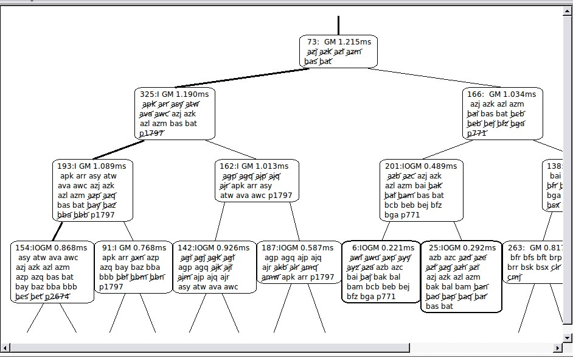

*UYARI!* Bu döküman Treemap algoritması konusunu işleyen 3 Ayrı grubun dökümanı incelendikten sonra hazırlanmıştır.

TreeMap
------

Treemap, özellik tabanlı Gauss SLAM için bir algoritma. Aslında, birçok düşük boyutlu Gauss (artan en küçük kareler) ürünü olarak tanımlanan yüksek boyutlu bir Gaussian'da artımsal olasılıksal çıkarım için bir algoritma. Treemap, SLAM'ın farklı türevlerini idare edebilir. Her şey, bir SLAM varyantına veya hatta bir sorun olan SLAM'a özeldir ve kullanıcı tarafından uyarlanabilen küçük bir sürücü katmanında bulunur.

-

Treemap'ın ana katkısı son derece verimli Gauss çıkarımıdır. Örneğin, 442 ms'de 1032271 2D özellikli bir haritada tam bir olasılık güncellemesi hesaplayabilir. Kısaca anlatmak gerekirse: Treemap Levenberg-Marquardt ile aynı işi yapıyor, ancak çok daha hızlı.

Treemap algoritmasının yanı sıra bu uygulama iki katmandan oluşur. Treemap arka uç, algoritmanın neredeyse tüm zorluklarını içerir. Düşük boyutlu birçok Gauss ürününün ürünü olarak tanımlanan yüksek boyutlu Gaussian'da çıkarım yapar. Düşük boyutlu Gausslar ölçümlere karşılık gelir. İkinci katman olan treemap sürücüsü, orijinal ölçümleri bu düşük boyutlu Gaussianlara dönüştürür, temel olarak ölçüm denklemlerini doğrusallaştırarak onları treemap arka uçına geçirir. Ayrıca bazı uygulamaya bağımlı yaklaşım politikasını tanımlar. Ardından, artalan, elde edilen Gauss'un ortalamasını hesaplar ve bu da, treemap sürücüsü tarafından bir harita tahmini haline dönüştürülür. Odometri olmaksızın 2D özellik tabanlı SLAM, 2D / 3DOF poz ilişki tabanlı SLAM ve 3D / 6DOF özellik tabanlı SLAM için sürücüler uyguladık.

Dolayısıyla, bir kullanıcı olarak, gerçek sayıların bir vektörü olarak ölçümler seti sağlamanız gerekir, yani ham sensör verileri üzerinde kendi özellik tespitinizi yapmanız gerekir. Ölçümlerin hangi özelliklerin kimliğini (veri ilişkilendirmesi) belirtmek zorundasınız. Bu ölçümler için de kovaryans (belirsizlikler) sağlamanız gerekir. Bu genellikle elle ayarlanmış bir parametredir. Yukarıda belirtilen SLAM varyantlarından birini yapıyorsanız, o kadar. Aksi halde, ölçüm denklemlerini doğrusallaştıran kendi sürücünüzü de uygulamanız gerekir ve arka uç için bir yaklaşım politikası tanımlar.

Treemap bir harita tahmini sağlar. Prensipte, veri ilişkisi için yararlı olacak kovaryans bilgileri sağlayabilir. Ancak, henüz uygulanmadı.

Farklı SLAM Varyasyonları için Genel Bir Açık Kaynak Arka Planı olarak: *Treemap*
--------------------------------------------------------------------------------

Treemap, 442 ms'de bir milyon yer işareti üzerinde bir döngüyü kapatan son derece büyük 2D haritaları tahmin etmek için başarıyla kullanılan genel bir SLAM algoritmasıdır. Şu anda SLAM'ın en çok değişkenini işleyebilecek bir açık kaynak uygulaması üzerinde çalışıyoruz. Burada, 6-DOF özellik tabanlı SLAM'ı gösteren ilk sonuçları gösteriyoruz.

http://www.informatik.uni-bremen.de/agebv/en/TreemapAsAGenericOpenSourceBackend?action=AttachFile&do=view&target=frese6dofslam.avi[]

Bu linkte eşleme sürecini gösterir. Robot, oda duvarlarında özelliklere sahip, 20 katlı bir bina içerisinden geçiyor. Daha sonra 19. kattaki bir köprüden başka bir 20 katlı binaya geçiyor ve bu binayı da haritalar. Son olarak, başlangıç ​​konumuna döner ve tüm özellikte bir döngü kapanır. Genel haritanın n = 106657 ve m = 5319956 gözlemlerin p = 488289 olduğu görülmektedir. Pozlar haritada gösterilmez. Hesaplama zamanı en fazla 209ms idi.

Anahtar nokta, iki katmanlı bir mimaridir. Treemap arka uç, algoritmanın neredeyse tüm zorluklarını içerir. Düşük boyutlu birçok Gauss ürününün ürünü olarak tanımlanan yüksek boyutlu Gaussian'da çıkarım yapar. Düşük boyutlu Gausslar measuremenets'e karşılık gelir. İkinci katman olan treemap sürücüsü, orijinal ölçümleri bu düşük boyutlu Gaussianlara dönüştürür, temelde ölçüm denklemlerini doğrusallaştırarak onları treemap arka uçına geçirir. Ayrıca bazı uygulamaya bağımlı yaklaşım ilkelerini tanımlar. Ardından, artalan, elde edilen Gauss'un ortalamasını hesaplar ve bu da, treemap sürücüsü tarafından bir harita tahmini haline dönüştürülür. Odometri olmaksızın 2D özellik tabanlı SLAM, 2D / 3DOF poz ilişki tabanlı SLAM ve 3D / 6DOF özellik tabanlı SLAM için sürücüler uyguladık.

PROJENİN DERLENMESİ
-------------------

Projeyi derlemek için terminale aşağıdaki komutları girelim ve çıktılarının resimde gözüktüğü gibi olmalarına dikkat edelim

[source,python]
-----------------
cd ~/treemap/trunk/treemap1Mtest/ && cmake 
-----------------

[source,python]
-----------------
make 
-----------------

= PROJENİN ÇALIŞTIRILMASI

[source,python]
-----------------
cd ~/treemap/trunk/treemap1Mtest/ && ./treemap1Mtest
-----------------

image:108.jpg[]

= ÖRNEK VERİ SETİYLE TEST ETME

