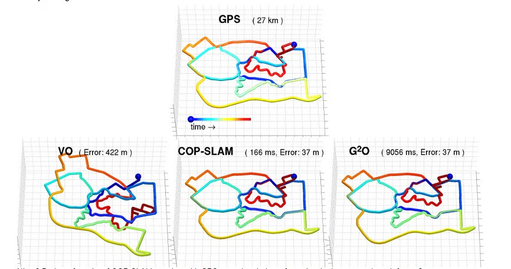
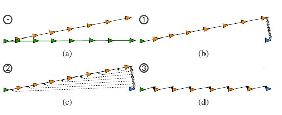
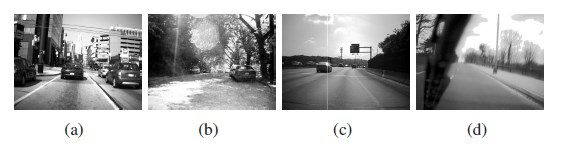
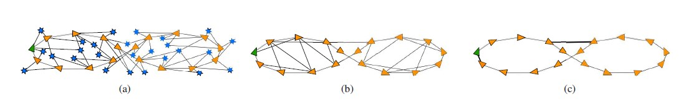
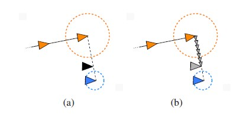
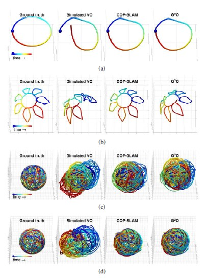
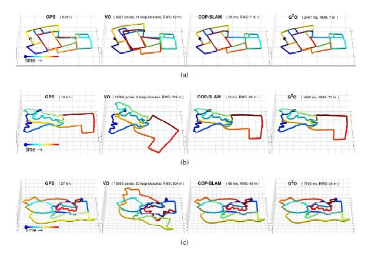
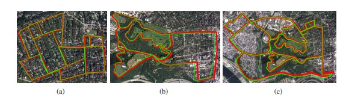

= COP SLAM

COP-SLAM son derece verimli bir kapalı formda 3-D SLAM yaklaşımıdır, poz zincirlerini çevrimiçi duruma getirir ve g2o ile uyumludur. COP-SLAM demo programı görsel odometri ve görünüş tabanlı döngü algılama ile elde edilen 60 kilometre poz zincir veri kümesiyle birlikte gelir.

Kapalı form Çevrimiçi Pose-chain SLAM (COP-SLAM), Lie grup yapısını istifade ederek kapalı zincirlerdeki poz zincirlerini etkili ve doğru bir şekilde optimize eder.
Poz zincirleri, son derece seyrek poz grafiklerin belirli bir türüdür ve doğru görsel odometri ve güvenilir görünüme dayalı döngü algılama gerçekleştiren çağdaş SLAM ön uçlarının bir ürünüdür.  
Sık döngü algılamanın istenmediği veya mümkün olmadığı büyük ölçekli 3 boyutlu ortamlarda zorlu robot uygulamaları için uygundurlar. Kapalı-Form Online Pose-chain SLAM tarafından elde edilen doğruluğun, en son yenilikçi yinelemeli yöntemlerle karşılaştırılabilir olduğu gösterilmiştir; buna karşılık çözümü hesaplamaya ihtiyaç duyan zaman büyüklükleri kadardır. Bu yeni SLAM tekniği, geniş bir robot uygulamaları ve hesaplama platformları yelpazesiyle ilgilidir. COP-SLAM demo programının harici bağımlılıkları yoktur ve 60 kilometre kullanıma hazır poz-zincir veri kümesiyle birlikte gelir. Dolayısıyla, bu veri kümelerinde COP-SLAM'ın oluşturulması ve çalıştırılması süreci oldukça basittir.

= Özet

Poz-grafik SLAM için kapalı formlu yeni bir çözüm sunulmuştur. Yörünge bükülmesinin genişletilmiş bir versiyonunu kullanarak poz zincirleri adı verilen özel yapının poz grafiklerini optimize eder. Çözümümüz, ön uçları en yeni görsel odometri ve görünüm tabanlı döngü algılama özelliğini kullanan sistemlerde kullanılmak üzere bir arka uç iyileştirici olarak tasarlanmıştır. Kapalı form yöntemimizin ve son teknoloji yineleyici yöntemlerin optimallik koşulları tartışıldı. Teorik farklılıklarının pratik önemi simüle edilmiş ve gerçek veriler kullanılarak yapılan kapsamlı deneylerle araştırılmıştır. 49 kilometrelik zorlayıcı binoküler verilerle gösterildi ki, kapalı form çözümümüz tarafından elde edilen doğruluk en son teknoloji yinelemeli çözümlerle karşılaştırılabilirken, çözümünü hesaplamak için gereken süre 50 ila 200 kez faktördür daha düşüktür. Bu, yaklaşımımızı geniş bir uygulama yelpazesi ve hesaplama platformlarıyla ilişkilendirmektedir.

Genel grafiğe dayalı SLAM, poz-grafik SLAM ve poz zinciri SLAM arasındaki kavramsal farklılıklar Şekil 2'de gösterilmektedir. 1. Birkaç yıl önce, SLAM ön uçları tipik olarak, tek bir lazer mesafe tarayıcı ile düzenli odometri (tekerlek dönüşü ve direksiyon açısı) içeriyordu. Bu tür ön uçlar, arka uç içerisindeki poz ve yer işaretlerine göre optimum hale getirme ihtiyacını yaratan nispeten hatalı ilk tahminler üretmiştir (Şekil 1.a). Sensör teknolojisi ve işleme gücü yıllar içinde ilerledikçe, ön uçlardaki yöntemler daha doğru başlangıç tahminleri üretmeye başladı. Bu, poz-grafik SLAM'ı popüler bir teknik haline getiren SLAM arka ucuna verilen gereksinimleri düşürdü (Şekil 1.b). Modern state-of-the-art visual odometry ve görünüm tabanlı döngü saptama teknikleri, doğruluk ve güvenilirlikte belirgin bir artış göstermiş ve modern bilgisayar donanımıyla yükümlüdür. Bu modern tekniklerin hata sapması nispeten düşük olduğundan, her zaman tutmak zorunlu değildir SLAM ön ucundaki mutlak pozlar arasındaki tüm kenarların izini. Ortaya çıkan seyrek grafiği poz zinciri olarak adlandırırız (Şekil 1.c).

Yukarıdaki görsel orijinal yörünge eğilme algoritmasının kavramsal gösterimi. (A) 'da yeryüzündeki hakikat yörüngesinin mutlak pozları, yeşil üçgenlerle ve yeryüzündeki gerçeğe göre, yeşil kenarlarla göreceli poz yer değiştirmeleri ile tasvir edilmiştir. Yörüngenin mutlak pozları için tahminler, turuncu üçgenlerle ve siyah kenarlarla göreli poz yer değiştirmeleri için olan tahminlerle gösterilir. Belirli bir zamanda, sistem son mutlak pozu, yani (b) 'deki mavi üçgen hakkında daha doğru bilgi alır. İlk adım, (b) 'deki küçük açık gri üçgenler tarafından gösterilen göreceli poz güncellemelerini bulmak ve bu da son mutlak pozu arzu edilen son pozu, yani mavi üçgenin üzerine getirmektir. Bu güncellemelere yerel güncelleştirme denir. İkinci adım ise, bu yerel güncellemeleri yörüngesine yayan dönüşümleri hesaplamaktır (c). Bu dönüşümlerin sonucu, (d) 'de küçük siyah üçgenlerle gösterilen dağıtılmış güncellemelerdir. (D) 'de dağıtılmış güncellemeler ile birlikte göreli poz deplasmanları kullanılarak gelişmiş bir yörünge hesaplanır. Sonuç, yörüngenin arzulanan mutlak pozlamada sona ermesidir.

Denemelerde kullanılan üç binoküler veri kümesinden örnek resimler.

Aşağıdaki örnekte çeşitli grafik tabanlı SLAM resimlerinin çizimi gösterilmiştir. Genel grafik SLAM (a), poz-grafik SLAM (b), zincir-zincir SLAM (c). İlk mutlak poz, yeşil üçgen ve ardışık mutlak pozlar turuncu üçgenlerle gösterilir. Simgeler, mavi yıldızlarla gösterilir. Düğümler arasındaki kenarlar (yani mutlak pozlar ve yer işaretleri) siyah çizgilerle gösterilir. (A) 'da, (b, c)' de yer işareti gözlemleri, göreli poz deplasmanlarını modelliyor. (C) 'de iki döngü kapanış kenarı ağır siyah çizgilerle işaretlenmiştir.

Yörünge bükümü için dış (a) ve iç (b) kaynaşma mekanizmaları. Son mutlak pozdaki belirsizlik, turuncu daire ve mavi daire tarafından arzulanan pozdaki belirsizlik ile gösterilir. Son mutlak poz ile arzulanan pozun optimal kombinasyonu, (a) daki siyah üçgen ile gösterilir. (B) 'de yerel güncellemeler, son mutlak poz ve arzulanan pozun optimum kombinasyonu ile aynı yere sahip olan büyük gri üçgene biter.

Her bir veri seti için 100 simüle edilmiş yörüngeden birinde elde edilen iki yöntemin sonuçları. (A) 'da çiçek, (b) çiçek, (c)' de 5 döngü bulunan dünya ve (d) 'de 25 döngü bulunan dünya gösterilmektedir. Soldan sağa: gerçek doğruluk, simüle görsel odometri, COP-SLAM, G2O

Sonuçlar, her iki yöntem için üç boyutlu ve her üç Pittsburgh veri setinde çizilmiştir. Pittsburgh-A (a), Pittsburgh-B (b) ve Pittsburgh-C (c) 'de gösterilmiştir. Soldan sağa: GPS doğruluk, görsel odometri, COP-SLAM, G2O. Fayans boyutu 200 metredir.

COP-SLAM'ın sonuçları, üç Pittsburgh veri seti için havadan ve topografik görüntülerin üstüne çizildi. Pittsburgh-A (a), Pittsburgh-B (b) ve Pittsburgh-C (c) 'de gösterilmiştir. GPS esaslı toprak gerçeği yörüngeleri, COP-SLAM tarafından yeşil olarak tahmin edilen kırmızı ve yörüngeler halinde çizilmiştir.

=PSEUDO KOD

**while running *do*
Get edge from SLAM front-end
if edge is a loop-closing edge then
Restrict computations to the Lie group of rotations.
R.1) Get 2
Dn
and compute 2
An
with Eq. 9.
R.2) Use Eq. 10, 3, 4 and 7 to compute the distributed updates.
R.3) Multiply  of each edge with the  of Eq. 13.
Recompute all absolute poses given the distributed updates.
Restrict computations to the Lie group of translations.
T.1) Get 2
Dn
and compute 2
An
with Eq. 9.
T.2) Use Eq. 10, 3, 4 and 7 to compute the distributed updates.
T.3) Multiply  of each edge with the  of Eq. 13.
Recompute all absolute poses given the distributed updates.
else
Add successive edge to end of pose-chain and compute new last
absolute pose
end if
end while

= KURULUM ve ÇALIŞTIRMA

* <Dir> dizininde COP-SLAM paketini açtığınızı veya teslim aldığını varsayarak,

* Yükleyin ve çalıştırın
[source,java]
$ cd <dir>/build
$ cmake ../
$ make install
    

Bu, her şeyi kurar ve dizindeki her şeyi yükler: <dir> / bin
(Bu nedenle süper kullanıcı ayrıcalıkları gerekmez)

* Tüm 7 veri kümesindeki COP-SLAM demo'sunu çalıştırın

[source,java]
$ cd <dir>/bin
$ ./run_demo.sh

* Tüm 7 veri kümesi için COP-SLAM sonuçlarını görselleştirin

**1) **Octave (veya matlab) kullanın ve
[source,java]
$ octave
>> cd <dir>/bin
>> showG2OFiles

**2)**Veya g2o paketinin g2o_viewer sürümünü kullanın. Daha fazla bilgi için openslam.org'daki g2o projesine bakın.

= Algoritmaların (Matematiğin) Kod Karşılıkları

*[underline]#Algoritma#*

trajectory

A~t~=^t^∏~i=1~ M~i~ = M~1~ * M~2~ * M~3~... * M~t~ (1)

D~n~=A~n~*^n^∏~i=1~U~i~ (2)

U~t~ = I(^t−1^Σ~i=1~w~i~)^−1^I(^t^Σ~i=1~w~i~) (3)

I(α) = A~n~ * exp(α log(A~n~^−1^
* D~n~)) (4)

w~t~ =1/σ^2^~t~ ^n^Σ~i=1~1/σ^2^~i~ (5)

*[underline]#Kod#*

[source,]
----
// integrate trajectory upto current time-step
	    integrateChain( start, end, true );

	    // compute loop closure update
	    // only keep transaltion part
	    lcupdate = poseVector[end*4].inverse()*closeVector[n];
	    lcupdate.linear() << 1.0f,0.0f,0.0f,
				 0.0f,1.0f,0.0f,
				 0.0f,0.0f,1.0f;

	    // interpolate loop closure update into segments
	    normalizers = normalizers + interpolateTra( lcupdate, closeVector[n], n, start, end );

	    // apply the change of basis to the translation updates
	    cobChain( start, end, TRANSLATION );

	    // update the relative poses
	    updateChain( start, end, TRANSLATION );
	  }
	}
----

[source,]
----
//
// interpolate the loop closure update into segements
//
Eigen::Vector3f poseChain::interpolateRot( Eigen::Affine3f aupdate, Eigen::Affine3f adesired, const int aclosure, const int astart, const int aend )
{
   // helper variables
   Eigen::AngleAxisf aa;
   Eigen::Vector3f   normalizers(0.0f,0.0f,0.0f);
   Eigen::Affine3f   before;
   Eigen::Affine3f   after;
   Eigen::Affine3f   motion;
   Eigen::Affine3f   adesiredInv = adesired.inverse();
   float             rotNormalizer, sv;

   // convert rotation to tangent space at identity
   aa = aupdate.rotation();
   float angle = aa.angle();
   if( M_PI < angle )
     angle = angle - 2*M_PI;

   // get normalizer for weights  
   sv             = rotInfoVector.block( astart+1, 0, (aend-astart), 1 ).sum();
   normalizers[1] = ( 1.0f / ( 1.0f + (sv/rotCloseInfoVector(aclosure)) ) );
   rotNormalizer  = globalNormalizer * (sv + rotCloseInfoVector(aclosure));

   // compute updates
   int start     = (astart+1)*4; 
   int end       = aend*4;
   int nn        = (astart+1);
   for( int n = start; n <= end; n = n+4 )
   {

      // compute relative rotation
      motion.linear() = Eigen::AngleAxisf( angle*(rotInfoVector(nn,0)/rotNormalizer), aa.axis() ).toRotationMatrix();
      poseVector[n+3].linear() = adesired.linear()*motion.linear()*adesiredInv.linear();      
      nn++;     
   }        

   // return the normalizer for later use
   return normalizers;

}

//
// compute absolute poses from relative poses
//
void poseChain::integrateChain( const int astart, const int aend, const bool aidentity )
{

   // first abolute pose is identity
   Eigen::Affine3f temp;
   if( aidentity )
   {
     temp                 = poseVector[astart*4];
     poseVector[astart*4] = Eigen::Translation<float,3>(0.0f,0.0f,0.0f) * Eigen::Quaternion<float>(1.0f,0.0f,0.0f,0.0f);
   }

   // go through the relative poses
   int start = (astart+1)*4;
   int end   = aend*4;     
   EIGEN_ASM_COMMENT("begin");
   for( int n = start; n <= end; n = n+4 )
   {

      // and integrate the absolute pose chain
      poseVector[n] = poseVector[n-4]*poseVector[n+1];

   }
   EIGEN_ASM_COMMENT("end");

   // set back
   if( aidentity )
   {
     poseVector[astart*4] = temp;
   }

}

//
// compute absolute poses from relative poses
//
void poseChain::integrateChainNormalized( const int astart, const int aend, const bool normalize )
{

   // go through the relative poses
   int start = (astart+1)*4;
   int end   = aend*4;     
   EIGEN_ASM_COMMENT("begin");
   if( normalize )
   {
      // normalize relative poses
      for( int n = start; n <= end; n = n+4 )
      {
	  // normalize relative rotations
	  poseVector[n+1].linear() = poseVector[n+1].rotation();
      }            
   }

   // integrate
   for( int n = start; n <= end; n = n+4 )
   {
      // and integrate the absolute pose chain
      poseVector[n] = poseVector[n-4]*poseVector[n+1];      
   }

   EIGEN_ASM_COMMENT("end");

}
----

*[underline]#Algoritma#*

B=1/(1/σ^2^~A~~n~+1/σ^2^~D~~n~)

*[underline]#Kod#*

[source,]
----
void poseChain::updateChain( const int astart, const int aend, const int amethod )
{

   // go through the relative poses
   int start             = (astart+1)*4; 
   int end               = aend*4;
   int nn                = 0;
   float scaleCorrection = 1.0f;
   Eigen::Affine3f tmp;
   EIGEN_ASM_COMMENT("begin");
   if( amethod == BOTH )
   {
      for( int n = start; n <= end; n = n+4 )
      {

	  // update the relative poses
	  tmp             = poseVector[n+1]*poseVector[n+3];
	  poseVector[n+1] = tmp;

      }
   }
   else if( amethod == ROTATION )
   {
      for( int n = start; n <= end; n = n+4 )
      {	

	  // update the relative rotations
	  poseVector[n+1].linear() = poseVector[n+1].linear() * poseVector[n+3].linear();

      }
   }
   else if( amethod == TRANSLATION )
   {
      for( int n = start; n <= end; n = n+4 )
      {

	  // update the relative translations
	  poseVector[n+1].translation() = poseVector[n+1].translation() + poseVector[n+3].translation();

      }
   }
   else if( amethod == SCALE )
   {            

      for( int n = start; n <= end; n = n+4 )
      {

	  // update the relative translations
	  tmp                = poseVector[n+1];
	  scaleCorrection    = scaleCorrection*pow( scaleCloseFactor, scaleInfoVector(astart+1+nn)/scaleNormalizer );	
	  scaleVector(n/4,0) = scaleCorrection;
	  tmp.translation()  = scaleCorrection*poseVector[n+1].translation();
	  poseVector[n+1]    = tmp;	  
	  nn++;

      }            
      cout << "Loop-closure final scale correction: " << scaleCorrection << endl;

   } 
   EIGEN_ASM_COMMENT("end"); 
}
----
----

